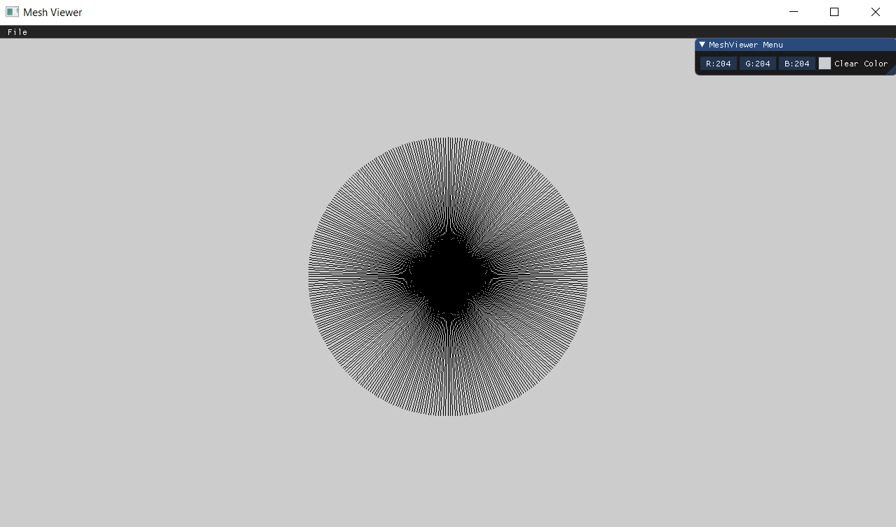

# Assignment 1 Report - Part 1:
In this assignment, we were asked to implement Bresenham's line algorithm.

The mindset I had when implementing the algorithm was to optimize it as much as I could, since the algorithm is called very frequently, and therefore its implementation is important for performance.
The optimizations I came up with are:
 - I used only one if-else statement in the algorithm for loop, since I preprocessed the given points and used auxiliary functions (BresenhamReflect and BresenhamSwitch) to set flags.
 - I saved 2dy and -2dx in variables op1 and op2, respectively, to avoid calculating them each time the loop iterates.

## Bresenham Code Snippets
These are code snippets of my implementations with comments describing my thinking process:
```cpp
int Renderer::BresenhamReflect(int delta) 
{ // Determining a move direction according to the change in axis
  // Output: a suitable value, reflecting the change in a coordinate
	if (delta > 0)
		return 1; // -> Move in the positive direction
	else if (delta < 0)
		return -1; // -> Move in the opposite direction
	else
		return 0;  // -> No change in axis, no move is required
}

void Renderer::BresenhamSwitch(int& dx, int& dy, short& x_switch, short& y_switch) 
{ // Switching x and y roles if needed and setting on/off switches: x_switch, y_switch (0 -> off, 1 -> on)
	if (dx < dy) {
		// dx >= 0 AND dy >= 0, therefore if true: (slope < -1) OR (slope > 1)
		int temp = dx;
		dx = dy;
		dy = temp;
		x_switch = 0; // Turning off moving x
		y_switch = 1; // Turning on moving y
	}
	else {
		x_switch = 1; // Turning on moving x
		y_switch = 0; // Turning off moving y
	}
}

void Renderer::DrawLine(const glm::ivec2& p1, const glm::ivec2& p2, const glm::vec3& color) 
{ // Implementing Bresenham algorithm: drawing a line of color from p1 to p2
	int dx = p2.x - p1.x, dy = p2.y - p1.y;
	if (dx == 0 && dy == 0) {
		PutPixel(p1.x, p1.y, color);
		return;
	}

	short x_dir = BresenhamReflect(dx), y_dir = BresenhamReflect(dy); // Setting x and y move directions, possible values: -1, 0, 1
	dx = dx > 0 ? dx : -dx;
	dy = dy > 0 ? dy : -dy;
	short switch_x, switch_y; // Used as on/off switches for x and y more directions: 0 -> off, 1 -> on
	BresenhamSwitch(dx, dy, switch_x, switch_y); // Switching x and y roles if needed and setting the on/off switches

	int x = p1.x, y = p1.y, e = -dx, op1 = 2 * dy, op2 = -2 * dx; // op1 and op2 for optimization
	for (int i = 0; i < dx; i++) {
		PutPixel(x, y, color);
		e += op1;
		if (e > 0) {
			x += x_dir;
			y += y_dir;
			e += op2;
		}
		else { // Will move in x direction or y direction, but not both
			x += x_dir * switch_x;
			y += y_dir * switch_y;
		}
	}
}
```

## Sanity Check
We were asked to draw lines in all directions in order to verify that an implementation was correct.
The following is an image of the sanity check results:



## A Drawing of My Choice
As a drawing of my own choice, I drew the Wonder Woman logo. 
Below is a screenshot of the results:


