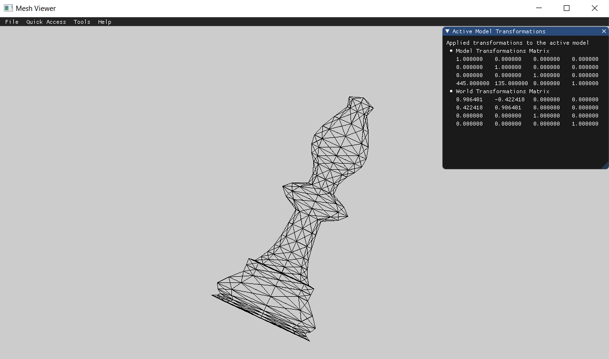
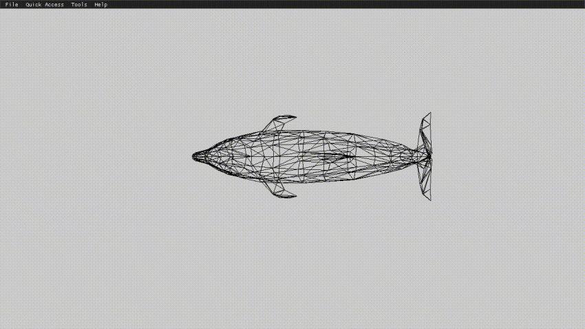

# Assignment 1 Report - Part 2:

To ensure that the mesh transformations are correct before moving forward, we were asked to load a mesh, display it and apply simple transformations to it.  
  
This report also describes some additional functionalities I implemented, to facilitate user experience and future requirements, which were not part of the assignment.

## Loading Mesh Models
As a first step, we needed to load a small mesh and output its vertices and faces to the console.  
  
The output to the console when loading "demo.obj" is shown below.
```
---------- Vertices (14) ----------
 0.00000        0.00000        0.00000
 2.00000        0.00000        0.00000
 2.00000        2.00000        0.00000
 0.00000        2.00000        0.00000
 0.00000        0.00000       -2.00000
 2.00000        0.00000       -2.00000
 2.00000        2.00000       -2.00000
 0.00000        2.00000       -2.00000
-0.60000        1.00000       -1.00000
 1.00000       -0.60000       -1.00000
 2.60000        1.00000       -1.00000
 1.00000        2.60000       -1.00000
 1.00000        1.00000        0.60000
 1.00000        1.00000       -2.60000

---------- Faces (24) ----------
 [v1: 1, vt1: 0, vn1: 1]                 [v2: 13, vt2: 0, vn2: 2]                [v3: 4, vt3: 0, vn3: 1]
 [v1: 4, vt1: 0, vn1: 3]                 [v2: 13, vt2: 0, vn2: 4]                [v3: 3, vt3: 0, vn3: 3]
 [v1: 3, vt1: 0, vn1: 5]                 [v2: 13, vt2: 0, vn2: 6]                [v3: 2, vt3: 0, vn3: 5]
 [v1: 2, vt1: 0, vn1: 7]                 [v2: 13, vt2: 0, vn2: 8]                [v3: 1, vt3: 0, vn3: 7]
 [v1: 4, vt1: 0, vn1: 1]                 [v2: 9, vt2: 0, vn2: 9]                 [v3: 1, vt3: 0, vn3: 1]
 [v1: 8, vt1: 0, vn1: 10]                [v2: 9, vt2: 0, vn2: 11]                [v3: 4, vt3: 0, vn3: 10]
 [v1: 5, vt1: 0, vn1: 12]                [v2: 9, vt2: 0, vn2: 13]                [v3: 8, vt3: 0, vn3: 12]
 [v1: 1, vt1: 0, vn1: 14]                [v2: 9, vt2: 0, vn2: 15]                [v3: 5, vt3: 0, vn3: 14]
 [v1: 5, vt1: 0, vn1: 16]                [v2: 14, vt2: 0, vn2: 17]               [v3: 6, vt3: 0, vn3: 16]
 [v1: 8, vt1: 0, vn1: 12]                [v2: 14, vt2: 0, vn2: 18]               [v3: 5, vt3: 0, vn3: 12]
 [v1: 7, vt1: 0, vn1: 19]                [v2: 14, vt2: 0, vn2: 20]               [v3: 8, vt3: 0, vn3: 19]
 [v1: 6, vt1: 0, vn1: 21]                [v2: 14, vt2: 0, vn2: 22]               [v3: 7, vt3: 0, vn3: 21]
 [v1: 3, vt1: 0, vn1: 23]                [v2: 11, vt2: 0, vn2: 24]               [v3: 7, vt3: 0, vn3: 23]
 [v1: 2, vt1: 0, vn1: 5]                 [v2: 11, vt2: 0, vn2: 25]               [v3: 3, vt3: 0, vn3: 5]
 [v1: 6, vt1: 0, vn1: 26]                [v2: 11, vt2: 0, vn2: 27]               [v3: 2, vt3: 0, vn3: 26]
 [v1: 7, vt1: 0, vn1: 21]                [v2: 11, vt2: 0, vn2: 28]               [v3: 6, vt3: 0, vn3: 21]
 [v1: 3, vt1: 0, vn1: 3]                 [v2: 12, vt2: 0, vn2: 29]               [v3: 4, vt3: 0, vn3: 3]
 [v1: 4, vt1: 0, vn1: 10]                [v2: 12, vt2: 0, vn2: 30]               [v3: 8, vt3: 0, vn3: 10]
 [v1: 8, vt1: 0, vn1: 19]                [v2: 12, vt2: 0, vn2: 31]               [v3: 7, vt3: 0, vn3: 19]
 [v1: 7, vt1: 0, vn1: 23]                [v2: 12, vt2: 0, vn2: 32]               [v3: 3, vt3: 0, vn3: 23]
 [v1: 1, vt1: 0, vn1: 7]                 [v2: 10, vt2: 0, vn2: 33]               [v3: 2, vt3: 0, vn3: 7]
 [v1: 2, vt1: 0, vn1: 26]                [v2: 10, vt2: 0, vn2: 34]               [v3: 6, vt3: 0, vn3: 26]
 [v1: 6, vt1: 0, vn1: 16]                [v2: 10, vt2: 0, vn2: 35]               [v3: 5, vt3: 0, vn3: 16]
 [v1: 5, vt1: 0, vn1: 14]                [v2: 10, vt2: 0, vn2: 36]               [v3: 1, vt3: 0, vn3: 14]
```

## Fit Model to Window
For us to be able to see the loaded model clearly on screen later, we had to transform it to fit the window.  
I performed the following operations to meet the requirement:  
- Among the model vertices, I determined the min and max values of x, y, and z.
- Next, I divided 500.0 by the distance from (min.x, min.y) to (max.x, max.y). Using this value, let's call it "scale", we can scale the model to a reasonable size.
- The translation and scaling matrices I came up with are below:  
  
    
  
  
- By multiplying the above translation and scaling matrices, and applying the received transformation matrix to the vertices, the model is transformed to be placed at (0,0) and fit the screen.
  
Below is the code for the FitToScreen() function, described above.
```cpp
void MeshModel::FitToScreen() {
	constexpr float min_value = std::numeric_limits<float>::min(), max_value = std::numeric_limits<float>::max();
	glm::vec3 min_point(max_value, max_value, max_value), max_point(min_value, min_value, min_value);

	for each (glm::vec3 vertex in vertices)
	{
		min_point.x = std::min(min_point.x, vertex.x);
		min_point.y = std::min(min_point.y, vertex.y);
		min_point.z = std::min(min_point.z, vertex.z);
		max_point.x = std::max(max_point.x, vertex.x);
		max_point.y = std::max(max_point.y, vertex.y);
		max_point.z = std::max(max_point.z, vertex.z);
	}

	auto scale_by = 500.0 / glm::distance(glm::vec2(min_point), glm::vec2(max_point));
	glm::mat4 translation = MathHelper::GetTransformationMatrix(TRANSFORMATION::TRANSLATION, -scale_by * min_point.x, -scale_by * min_point.y, 0);
	glm::mat4 scaling = MathHelper::GetTransformationMatrix(TRANSFORMATION::SCALING, scale_by, scale_by, scale_by);

	ApplyTransformationToVertices(translation * scaling);
}
```
  
## Drawing Models
I was able to display loaded models on the screen by ignoring the z coordinate. Following are some screenshots.
### Beethoven


### Teapot


### Cow


## GUI Items

  
Above is an image of the GUI I designed.

In the image, you can see the "Mesh Controller" window includes a collapsible header for each loaded model.
The collapsible header of the active model contains sliders for modifying transformations, whereas all other collapsible headers include a button for activating the model.

The image above also shows the "Active Model Transformations" window, which displays the model transformation matrix and the world transformation matrix applied to the active model.   

The transformations are computed as shown in the following equation:  

  
### Additional GUI Items
In addition to the assignment requirements, I decided to add menus to the main menu bar, which include:  
- The "Quick Access" menu, which lets the user load mesh models faster, by selecting them from a list.  
  

  
- The "Tools" menu, that allows the user to close and open application windows as needed.  
  

  
- The "Shortcuts" window, displaying all available shortcuts, which can be opened from the "Help" menu.  
  


## Model vs. World Transformation
Presented below are two screenshots comparing model and world transformations as required by the assignment.  
  
- Translating in the model frame, then rotating in the world frame:  
  

  
- Translating in the world frame, then rotating in the local frame:  
  

  
## Transformations with Keyboard

The "Shortcuts" window image seen earlier, showed how to modify the basic transformations using the keyboard.  
Using meaningful and conventional keys, I have tried to make the keyboard transformations modification as intuitive as possible.

- Model and World transformations can be toggled using M and W keys, respectively.
- The left and right arrows can be used to move about the x-axis, while the up and down arrows can be used to move about the y-axis. Keypad's '0' and '.' keys can be used to move about the z-axis.
- Keypads '/' and '*' keys can be used to scale the model.
- Keypad's '1' and '3' keys can be used to rotate about the x-axis, '4' and '6' to rotate about the y-axis, and '7' and '9' keys to rotate about the z-axis.

## Demonstrations
### Translation  

### Scaling  

### Rotation about the x-axis 

### Rotation about the y-axis   

### Rotation about the z-axis 

### Rotation about all axis    

