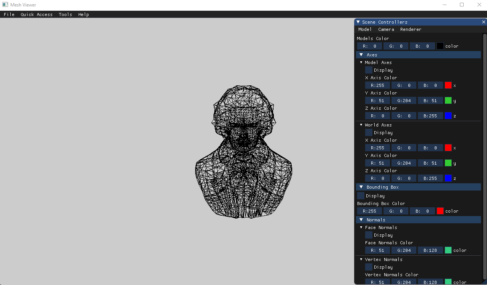

# Assignment 1 Report - Part 3:

This assignment aims to implement as much of the full assignment as possible.

## Orthographic Projection
I began the assignment by implementing a camera with an orthographic projection.  
The following screenshots compare different view volumes.  
  
  
  
  

## Setting the View Volume Automatically
The next step was to implement a feature for automatically setting the view volume, based on the window size.  
As my implementation maintains the aspect ratio of the original model, I verified the results with the following aspect ratios:  
- A window with a larger width than height.
- A window with a larger height than width.
- A window with a width equal to its height.  
  
Below are some screenshots of the sanity check results, which I selected because it examines all possible ratios.

### Window width > window height  
  
  
### Window width < window height  
  

### Window width = window height  
  
  
## Axes Feature
My next step was to implement a feature to draw the model and world axes. The following screenshots show how model and world transformations affect them.  
The red, green, and blue axes represent the world's, and the black, purple, and pink axes represent the model's.  

### Model Frame Transformations  
 
  
### World Frame Transformations    
 

## Model VS. World Frame Transformations
To illustrate the difference between model and world frame transformations, I have chosen the following non-commuting transformations:  
- T1: Rotate 60 degrees around the x-axis, and then 90 degrees around the z-axis.
- T2: Rotate 45 degrees around the y-axis.  

The following screenshots show my results.
  
### T1 in model frame T2 in world frame
 

### T2 in model frame T1 in world frame
 

## Bounding Box and Normals
As a sanity check for my implementation of bounding box, face normals, and vertex normals, I performed the following transformations on a model:
- Translate all axes.
- Scale all axes.
- Rotate around the x-axis.
- Rotate around the y-axis.
- Rotate around the z-axis.

As the bounding box and normals transformed with the model, I deduced that my implementation is correct.

### Beethoven Bounding Box
 

### Beethoven Normals
 

## Perspective Projection
My next step was to implement the perspective projection.  
Here are some screenshots to illustrate the difference between orthographic and perspective projection.

### Dolphin with Orthographic Projection
 
### Dolphin with Perspective Projection
 

### Bunny with Orthographic Projection
 
### Bunny with Perspective Projection
 

## Zoom
My implementation of perspective projection was followed by an implementation of zoom.  
Here are some screenshots to show the difference between changing the zoom and getting closer to a model.

### Teapot Zoom
 
### Teapot Closer
 

## Camera Rotations
Below are some screenshots showing the differences between camera frame rotations and world frame rotations.

### Camera Rotation in the Camera Frame Around the Y Axis
 
### Camera Rotation in the World Frame Around the Y Axis
 

## GUI
My goal was to make the user experience as seamless as possible, so I decided to cluster all scene controllers into one window that includes three tabs: Model, Camera, and Renderer, with which the user can control the models, camera, and rendered features.  
Below are screenshots of each tab.  

### Model Tab
 
### Camera Tab
 
### Renderer Tab
 

## Additional Features
- As can be seen in the screenshots of the "Setting the View Volume Automatically" section, I added a feature to make the menus responsive to the window size.
- As can be seen in the screenshots above, I implemented the ability to control the rendering color of the models, axes, bounding box and normals. 
- As described in previous assignments, I implemented a "Quick Access" menu, which lets the user load mesh models faster, by selecting them from a list.
- As described in previous assignments, I implemented a "Tools" menu, that allows the user to close and open application windows as needed.
- As described in previous assignments, I implemented a "Shortcuts" window, displaying all available shortcuts, which can be opened from the "Help" menu.
