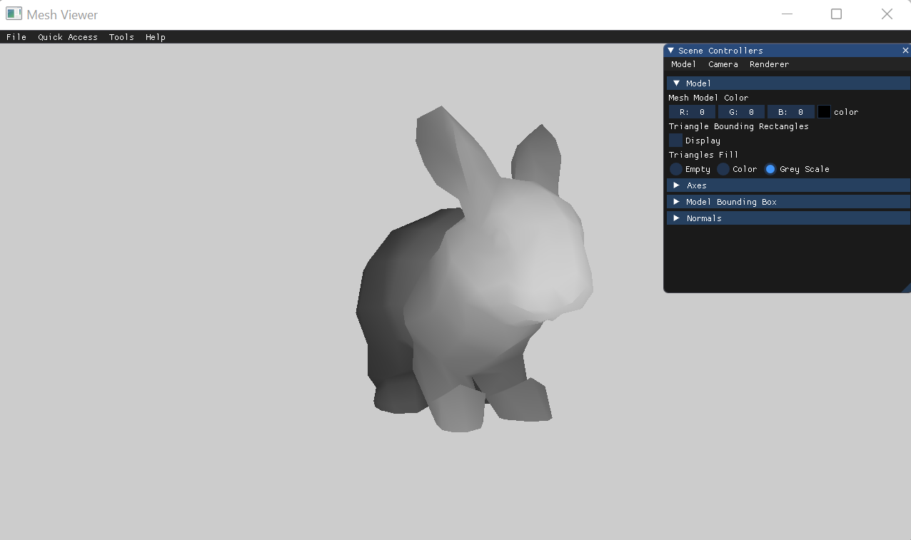

# Assignment 2 Report - Part 1:

The purpose of this assignment is to paint full triangles and implement the z-buffer algorithm.  

## Drawing Bounding Rectangles
I began by implementing a feature to draw the bounding rectangle for each triangle in a different color.  
The feature can be toggled on and off.  

 

## Filling Triangles
I then changed the DrawTriangle function to fill each triangle with a random color, using the edge walking approach.  

 

## The Z-Buffer Algorithm
In order to overcome triangles overlapping, I implemented the z-buffer algorithm.  
The following screenshots compare the color buffer and z-buffer.  

### Bunny using Color Buffer

### Bunny using Z-Buffer
 
### Teapot using Color Buffer

### Teapot using Z-Buffer
 
### Bishop using Color Buffer

### Bishop using Z-Buffer
 
