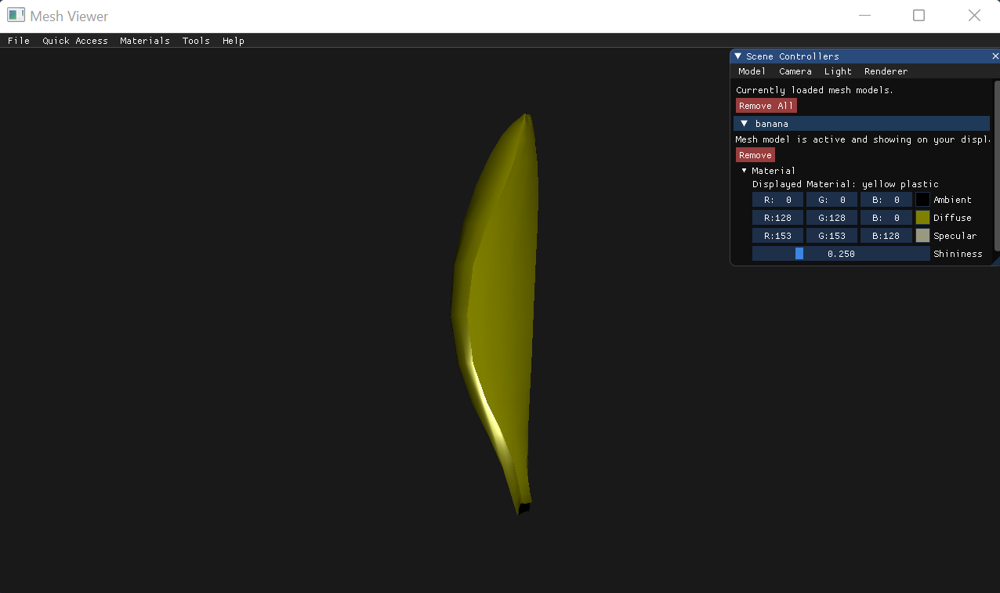
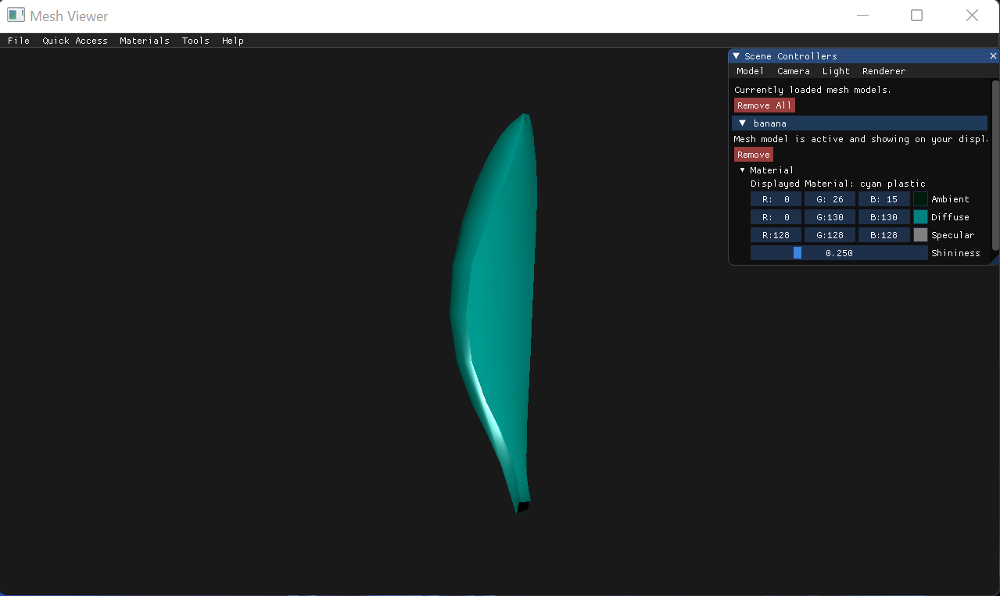
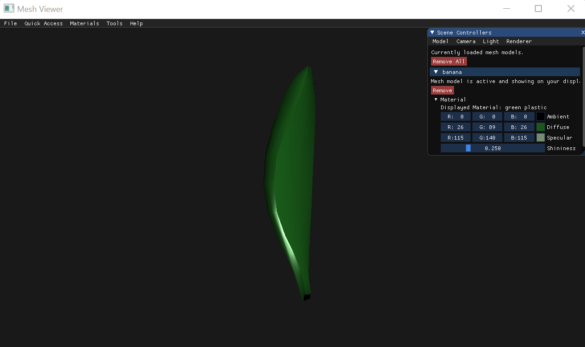
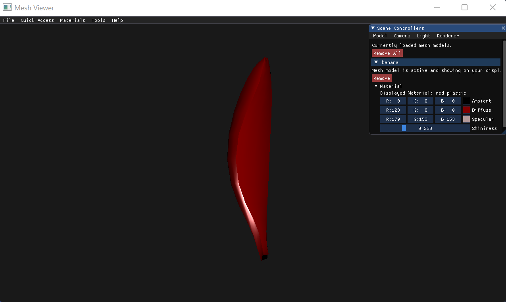
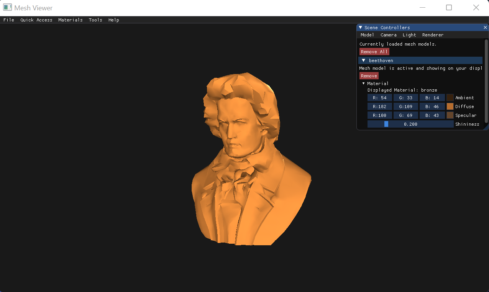
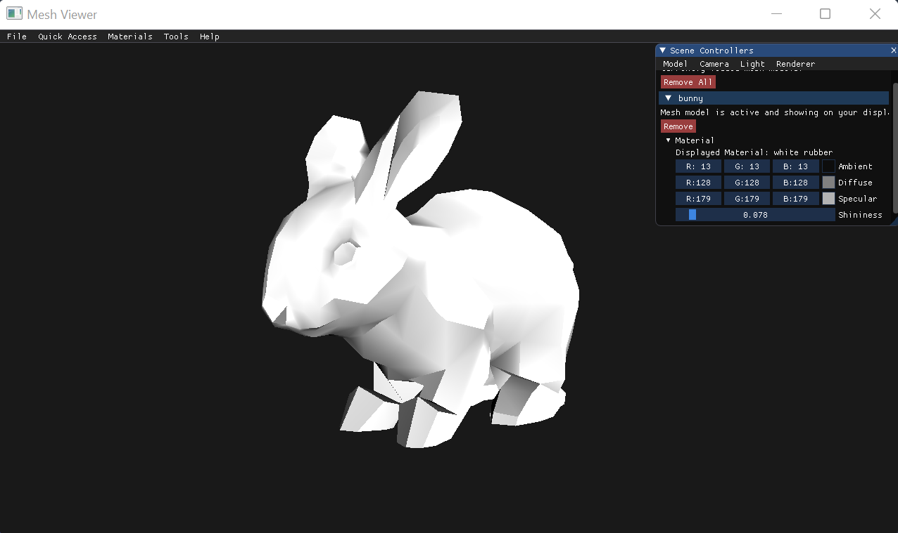
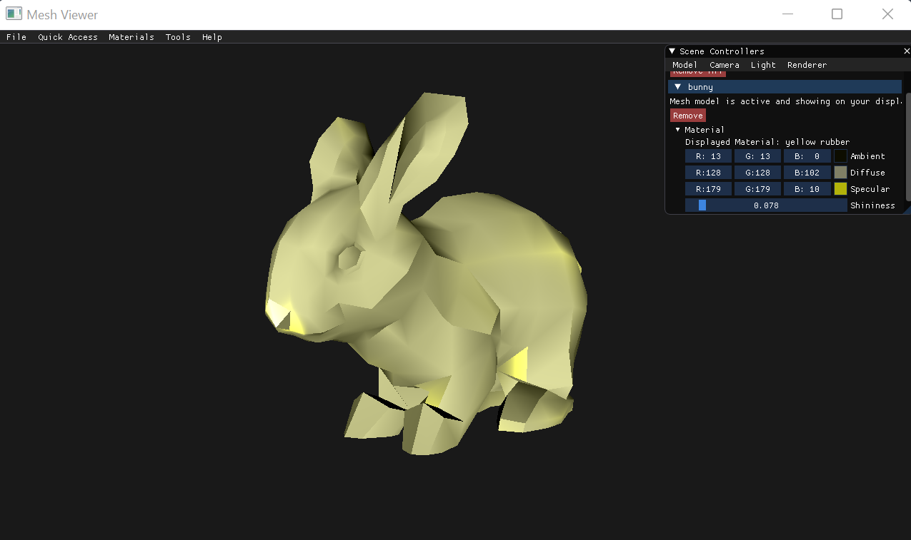
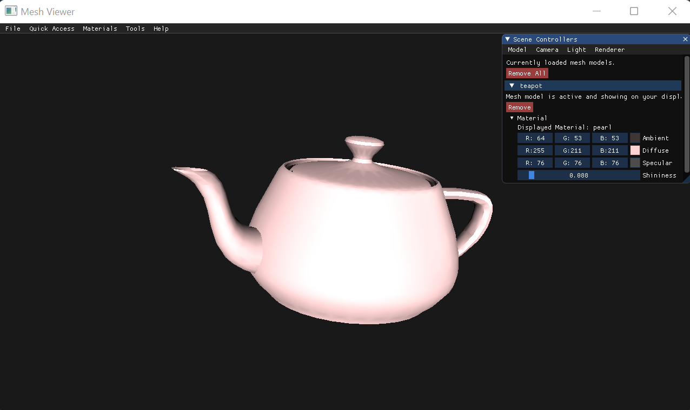
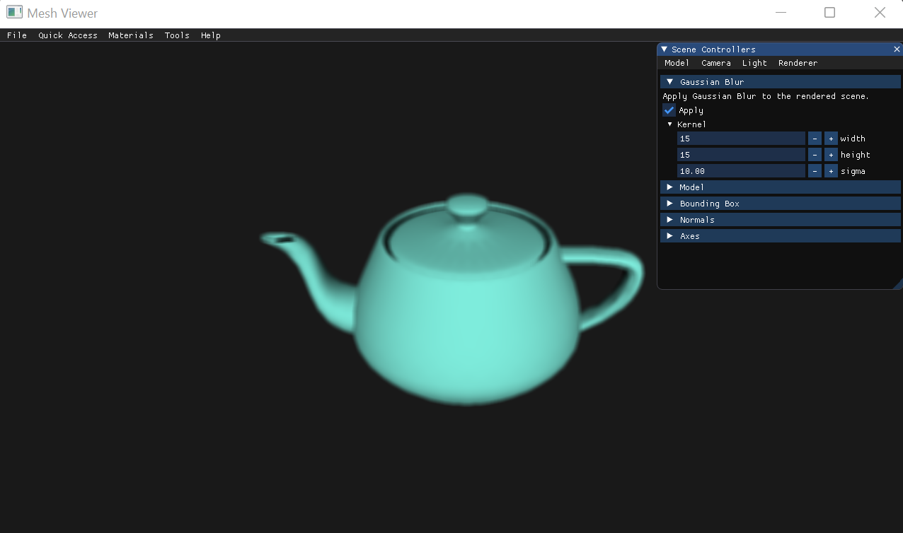

# Assignment 2 Report - Part 2:

For this assignment, I will add lights and display shaded models to complete the renderer.

## Ambient Lighting

Calculating the lighting for ambient light was my first step in the assignment.  
Here are some examples with my explanation of the results.  

### First Example

Illuminating with a white ambient light, on a blue ambient teapot, resulted in a blue teapot.  
As discussed in class, the ambient lighting is computed by multiplying the material's ambient with the light's ambient.  
Since the ambient of the teapot is blue and the ambient of the light is white, which is a 3d vector of 1's, the ambient lighting is similar to the ambient component of the teapot.  
  
 
  
On the other hand, illumanting with a red ambient light on the same teapot, resulted in a black teapot.  
The light's ambient red coordinate is the only non-zero coordinate, while the teapot's ambient red coordinate is the only zero coordinate.  
Multiplying these two vectors, results in a 3d vector of zeroes, which is black in color.  
  
 

### Second Example
As can be seen in the screenshot below, I changed the ambient lighting of a banana to a yellow shade, which has a non-zero value for the red, green, and blue coordinates.  
  

Since all of the banana's ambient coordinates have a non-zero value, illuminating it with a red ambient light resulted in a red shaded banana.  
  
  

Illuminating with a green ambient light, resulted in a green shaded banana. 
  
  

And illuminating with a blue ambient light resulted in a blue shaded banana.  
  
  

## Diffuse Lighting

I then computed the diffuse component using flat shading.  
Following is a screenshot of the scene displayed in the "Ambient Lighting" first example, with a white ambient and diffuse light.  
  
 

### Other Teapot Diffuse Component

 
  
 

## Reflection Vector

Below are screenshots of the direction of light and reflected light in a 1080x720 window for different light positions.  
  
### Light Position 0x0
#### Direction of Light
  
 
  
#### Direction of Reflected Light
  
 
  
### Light Position 640x360
#### Direction of Light
  
 
  
#### Direction of Reflected Light
  
 
  

### Light Position 1080x720
#### Direction of Light
  
 
  
#### Direction of Reflected Light
  
 
  
## Specular Lighting

Finally, I implemented specular lighting. 
The screenshots below illustrate phong shading with and without shininess for specular lighting.  

### Without Shininess

 
  
 
  
 

### With Shininess

 
  
 
  
 

## Demonstrations

To make it easier to use and demonstrate the app's functionalities and power, I implemented a "Materials" menu.  
Using the materials menu in the upper menu, the user can dress the active model with already configured materials.  
The following screenshots demonstrate some of the materials I configured on different models.  

### Plastic Banana

 
  
 
  
 
  
 

### Gold, Silver and Bronze Beethoven

 
  
 
  
 

### Rubber Bunny

 
  
 
  
 

### More Materials

#### Emerald Teapot
 
  
#### Obsidian Teapot
 
  
#### Pearl Teapot
 
  
#### Ruby Teapot
 
  
#### Turquoise Teapot
 
  
## Post-Processing Effect
  
I chose to implement Gaussian Blur as a post-processing effect.  
The screenshots below illustrate how the effect looks on different models for different kernel sizes.  
You can see the exact kernel data in the side window.  

### First Example  
 
 
### Second Example  
 
 
### Third Example
 
 
