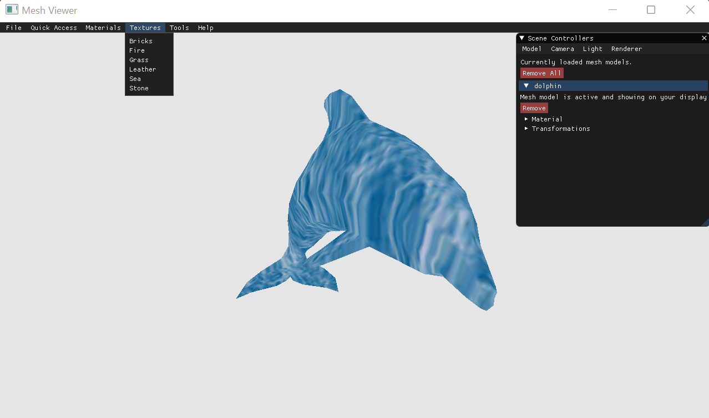
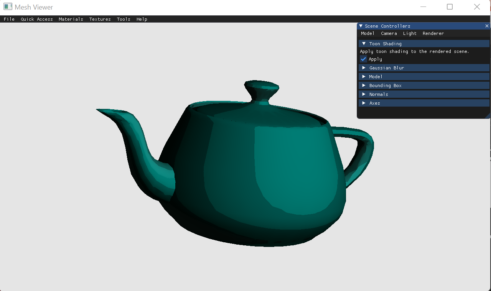
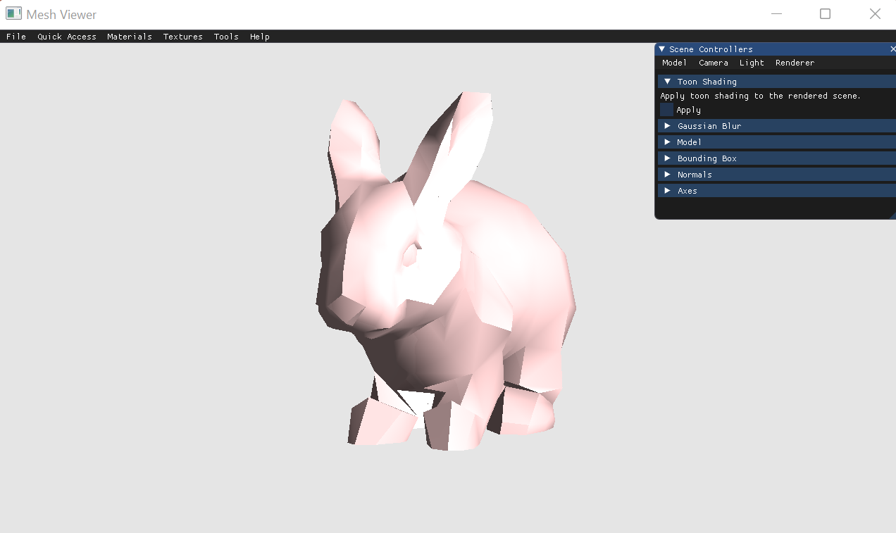
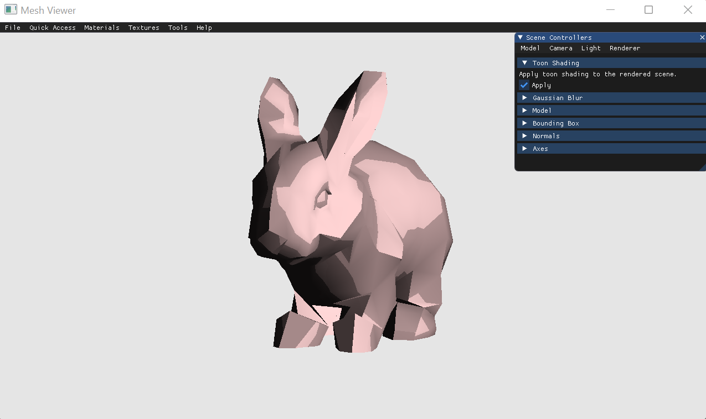

# Assignment 3 Report:

In this assignment, I will replace the software renderer implemented in the previous assignments with an OpenGL renderer.

## Renderer::InitOpenGLRendering() - Explained

1. Unique identifiers are created for an OpenGL texture and a VAO, and respectively stored in `gl_screen_tex` and `gl_screen_vtc`.
2. `gl_screen_vtc` is set to be the current vertex array.
3. A unique buffer identifier is created and stored in `buffer`.
4. `buffer` is set to be the current buffer.
5. The GLFloat's `vtc` and `tex` are copied to the GPU.
6. A vertex shader (`vshader.glsl`) and fragment shader (`fshader.glsl`) are loaded and compiled and then made the current program.
7. Two attributes are defined for the vertex shader: `vPosition` (vertex position data) and `vTexCoord` (texture position data).
8. `GL_TEXTURE0` is used as the texture id for a uniform variable `texture`.

### A higher-level explanation:

1. A color buffer is loaded on the GPU as a two-dimensional texture.
2. Two triangles covering the entire viewport are set to be drawn.
3. Pixels are assigned z=0 and w=1, and their texture coordinates are passed to the fragment shader.
4. Based on the interpolated texture coordinates, the fragment shader finds the correct color for each pixel.

## Vertex Shader

I first wrote a vertex shader that applies all the transformations.  
Here is its code.

```GLSL
#version 330 core

layout(location = 0) in vec3 pos;
layout(location = 1) in vec3 normal;
layout(location = 2) in vec2 texCoords;

uniform mat4 model;
uniform mat4 view;
uniform mat4 projection;

out vec3 fragPos;
out vec3 fragNormal;
out vec2 fragTexCoords;

void main()
{
	fragPos = vec3(model * vec4(pos, 1.0f));
	fragNormal = mat3(model) * normal;
	fragTexCoords = texCoords;
	gl_Position = projection * view *  model * vec4(pos, 1.0f);
}
```

## Fragment Shader

I then wrote a fragment shader that outputs a blue color.  
Below is its code.

```GLSL
#version 330 core

struct Material
{
	sampler2D textureMap;
};

uniform Material material;

in vec3 fragPos;
in vec3 fragNormal;
in vec2 fragTexCoords;

out vec4 frag_color;

void main()
{
	vec3 textureColor = vec3(texture(material.textureMap, fragTexCoords));
	frag_color = vec4(0, 0, 1, 1);
}
```

## Renderer 

By updating all the vertex attributes and uniforms in the renderer, I was able to view the mesh in my application.  
Here is the updated Renderer code and screenshots.  

```C++
void Renderer::Render(std::shared_ptr<Scene> scene)
{
	if (scene->HasModels())
	{
		auto& camera = scene->GetActiveCamera();
		camera.Refresh(viewport_width, viewport_height);

		auto& active_model = scene->GetActiveModel();
		active_model.Refresh();

		color_shader.use();

		color_shader.setUniform("model", active_model.GetTransformation());
		color_shader.setUniform("view", camera.GetViewTransformation());
		color_shader.setUniform("projection", camera.GetProjectionTransformation());
		color_shader.setUniform("material.textureMap", 0);

		texture.bind(0);

		glPolygonMode(GL_FRONT_AND_BACK, GL_FILL);
		glBindVertexArray(active_model.GetVAO());
		glDrawArrays(GL_TRIANGLES, 0, active_model.GetModelVerticesCount());
		glBindVertexArray(0);

		texture.unbind(0);
	}
}
```
  
 
  
 
  
## Phong Shading

I continued to implement Phong shading in the fragment shader.  
Here are screenshots of the horse model, which I loaded into my application to demonstrate that the performance has drastically improved.  
  
 
  
 
    
 
  
 
  
## Texture Mapping

My next step was to implement texture mapping.  
As a sanity check, I loaded the crate model and texture from the reference projection, before moving on to enabling a canonical projection.  
  
 
  
Then, I implemented the sphere canonical projection.  
I also added a 'Textures' menu to the top bar, with some built-in textures, to enhance the user experience.  
You can see some screenshots below.  
  
  
  
  
    
  
  
## Textured Model
  
The screenshots below demonstrate the texture mapping of a mesh with texture coordinates I found online, as required by the assignment.

### No Canonical Projection
  
  
  
### Sphere Canonical Projection
  
  
  
## Last, But not Least...  
To complete the assignment, I implemented toon shading using the algorithm we studied in class.  
In order to quantify the shading intensity, I selected the parameters shown in the code below, as I found them to be suitable after experimenting.  
  
```GLSL  
...
vec3 l = normalize(lights.list[i].pos.xyz - fragPos);
...
if (apply_toon_shading)
{
	vec3 toon_shading_color = vec3(1.0f, 1.0f, 1.0f);
	float intensity = dot(l, fragNormal);
	if (intensity > 0.85f)
		toon_shading_color = vec3(0.8f, 0.8f, 0.8f);
	else if (intensity > 0.5f)
		toon_shading_color = vec3(0.6f, 0.6f, 0.6f);
	else if (intensity > 0.15f)
		toon_shading_color = vec3(0.4f ,0.4f, 0.4f);
	else
		toon_shading_color = vec3(0.2f, 0.2f, 0.2f);
	color = color * toon_shading_color;
}
```  
Here are some screenshots showing the effect.  

### Teapot
  
  
  
### Teapot with Toon Shading
  
  
  
### Bunny
  
  
  
### Bunny with Toon Shading
  
  
  
### Sphere
  
  
  
### Sphere with Toon Shading
  
  
  
  
P.S  
Thanks for a fascinating semester :)
